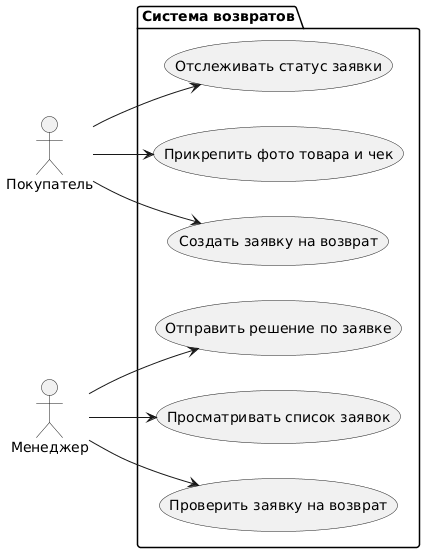
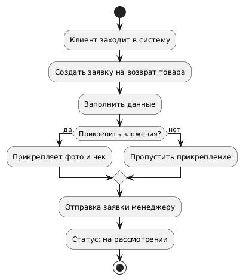
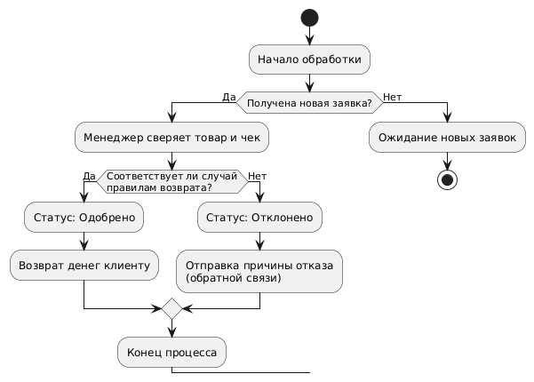
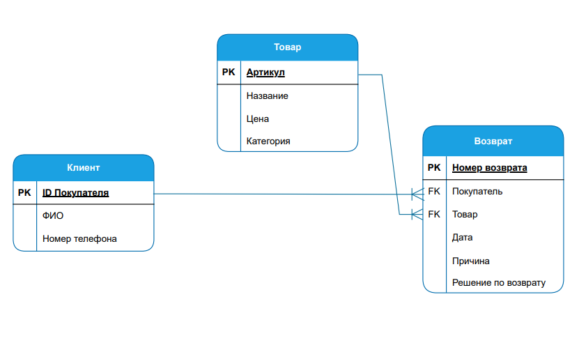

# Система учёта возврата товаров
## О проекте
*Проект представляет собой информационную систему для автоматизации процесса возврата товаров в магазин*
### Цели системы
- Ведите точный учёт возвратов товара, чтобы иметь возможность проводить аналитику, например определять, какие товары возвращают чаще всего.
- Упростить и ускорить процесс возврата товаров как для покупателей, так и для сотрудников (у них будет чёткий регламент действий).
- Автоматизировать этот процесс, ускорить обработку заявлений на возврат
## **Роли пользователей**
### *Клиент*
- Создание заявки на возврат
- Прикрепление фотографий товара и чека
- Просмотр статуса заявки
- Получение обратной связи
### *Менеджер по возврату*
- Просмотр и сортировка заявок
- Изменение статуса заявок
- Просмотр прикреплённых изображений
- Отправка обратной связи
  
## Юз-кейс диаграмма системы

## Блок-схемы
### 1

### 2

## ER-диаграмма

